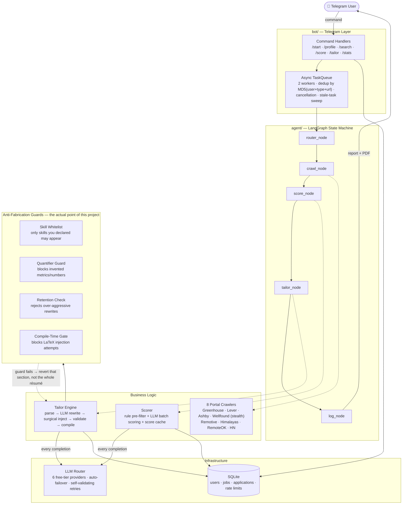

<div align="center">

# JobBot

**A Telegram bot that finds jobs, scores them against your real profile, and tailors your résumé — without inventing a single skill you don't have.**

[](https://www.python.org/)
[](https://github.com/langchain-ai/langgraph)
[](LICENSE)
[](#honest-state-of-the-project)

</div>

---

## Why I built this

I graduated in 2026 and, like everyone else that year, spent months doing the same tedious loop: open a job board, read a JD, decide if it's worth my time, tweak my résumé to match it, repeat. Somewhere around the fortieth application I got tired of doing it by hand and started automating the parts that were purely mechanical — crawling boards, checking fit against my own skills, rewriting a bullet point to use the JD's vocabulary instead of mine.

The part I refused to automate carelessly was the résumé itself. It is very easy to get an LLM to write a resume that looks great and says things that aren't true. Most "AI resume tailor" tools I looked at do exactly that — they optimize for a keyword match score, not for honesty. I did not want to build a lying machine and hand it my own job search. So the actual engineering problem I set out to solve wasn't "generate a resume" — it was "generate a resume that is provably still true," and everything about how this project is structured follows from that constraint.

This is a solo project, built while job hunting, and it is genuinely not finished. I'd rather tell you exactly what's solid and what's still rough than pretend otherwise — see [Honest state of the project](#honest-state-of-the-project).

---

## See it in action

This is a real request I ran against my own profile (core skills: Python, JavaScript, React, HTML — no Go beyond "familiar"), not a cherry-picked demo.

**The command:**

```
/score Full-Stack Engineer — Backend & Frontend

We're a small product team looking for a Full-Stack Engineer to own features
end-to-end, from the React frontend down to the Go backend services.

Requirements:
- Strong experience with Go (or similar backend language) for building REST APIs
- React experience for building frontend interfaces (JavaScript, HTML/CSS)
- Experience designing microservices architectures
- PostgreSQL for primary data storage
- OAuth-based authentication flows
- Comfortable owning a feature from database schema to UI

Nice to have: any exposure to LLM-based tooling (LangChain or similar).
```

**What came back:**

> 🎯 **Score: B | Match: 72%**
>
> 💪 **Strengths:** React, JavaScript, and HTML are core skills for the candidate · Microservices and REST API experience matches primary skills · OAuth and PostgreSQL align with secondary skills · LangChain exposure listed as nice-to-have matches a primary skill
>
> ⚠️ **Gaps:** GoLang is listed as a strong requirement but candidate has only secondary/familiar-level proficiency · Only 1 year of experience may be light for the "strong experience" bar in Go · Python expertise not directly utilized in this role

Notice what it *didn't* do: it didn't call this an A, and it didn't pretend the Go gap away. It told me the truth about where I'm short, in plain language, tied to my actual declared skill tiers — not a generic "keyword match" score.

**Then, on `/tailor`, the diff summary it handed back — every word grounded in an actual, computed, word-level diff, not the LLM's opinion of what it did:**

> 📝 **Changes Made — Experience:** The Experience section was updated to emphasize oAuth-based authentication, RESTful APIs, microservices-style separation of concerns, end-to-end workflows from database schema to UI, and reliable data pipelines, while removing references to generic scaling, interfaces, database transaction repositories, APIs, storage, and workflows.

That's not the LLM narrating itself. It's a deterministic `difflib` comparison of the before/after résumé text, which a *second*, tightly-constrained LLM call is only allowed to describe in plain English — it's structurally forbidden from mentioning anything that isn't in that diff. If the diff is empty, the summary says so. This is the same "don't trust, verify" instinct applied to the bot's own self-reporting, not just to the résumé content.

---

## Architecture



Three design decisions worth calling out, because they weren't obvious going in:

- **The failover router isn't just for uptime.** `llm_router.complete()` accepts a `validate_fn` — if a provider's response fails structural or content validation (malformed JSON, a hallucinated "no job description provided" excuse, a schema-valid-but-empty response), the router automatically retries with the *next* provider before ever handing bad output back to the caller. That mechanism caught a real production issue: one free-tier model occasionally returned syntactically valid but semantically empty scoring output, and the router silently routed around it. See [`testing-audit.md`](testing-audit.md) for the actual incident.
- **A validation guard reverts one section, not the whole résumé.** If the LLM tries to sneak an unverified skill into the Skills section, only that section reverts to the original text — the Summary and Experience rewrites, if they passed their own checks, still apply. Nothing gets thrown away because one part failed.
- **The whole pipeline degrades, it doesn't crash.** Portal down → skip it, keep the rest. Score call fails → neutral score, not a dead task. PDF compile fails → tell the user, don't take down a worker. This showed up as a deliberate pattern once I started writing it consistently, not as an accident.

---

## The idea behind it

The tailoring philosophy is: **grounding → verification → transparency.**

1. **Grounding** — the tailoring LLM is given an explicit `ALLOWED_SKILLS` list built from what you actually declared during onboarding, plus whatever the system can *verify* is genuinely mentioned elsewhere in your own résumé (not just the neat Skills line — a tool you used in a project bullet counts too). It is told, in the system prompt, that it may rephrase and re-emphasize, but never invent.
2. **Verification** — because prompts get ignored, every model output is checked in code, not trusted on faith:
   - **Skills** are diffed against the original, tokenized (handling comma lists *and* reformatted category labels), and checked one skill at a time against your allowed list — a synonym table (`react.js` ↔ `react`, `k8s` ↔ `kubernetes`, ~50 more) means legitimate rewording isn't mistaken for fabrication.
   - **Experience bullets** are checked for invented numbers — "reduced latency by 40%" doesn't get through unless that claim traces back to your original text.
   - A **word-retention check** rejects a rewrite if the LLM quietly deleted most of the original content instead of tailoring it.
   - A **compile-time gate** scans the final LaTeX for dangerous primitives (`\input`, `\write18`, …) before it's ever handed to `pdflatex` — because the JD text itself is untrusted input, and a prompt-injected JD trying to smuggle a LaTeX command into the output is a real attack surface, not a hypothetical one.
3. **Transparency** — you don't get a black box. You get an exact, word-level account of what changed and why, computed deterministically, not asserted by the same model that made the edit.

This is also, deliberately, why the project doesn't chase the "95% ATS match!" framing every competitor uses. Optimizing for that number rewards exaggeration. I'd rather ship something that tells you the truth about a 72% match than something that tells you what you want to hear.

---

## How I actually know it works

Talk is cheap, so I ran an adversarial testing pass against my own claims instead of just asserting them. The short version, documented in full in [`testing-audit.md`](testing-audit.md):

I hypothesized the validation guards above might be so strict that they'd silently kill the product — reject everything, ship nothing. I built a 12-call real-LLM test matrix (multiple synthetic profiles × multiple JD types, including deliberately adversarial ones: a prompt-injection attempt, a LaTeX-injection payload, a job requiring skills the test profile didn't have) and ran it for real, against real providers.

**First run: 0/12 succeeded. Zero.** Not because validation was too strict in the abstract — I root-caused it to four specific, fixable bugs (a quantifier guard that flagged numbers being *removed*, not just invented; a whitelist check operating on merged diff chunks instead of individual skills; a final validation pass checking pre-revert content instead of what was actually kept; one dead free-tier model in the provider chain). Fixed all four, re-ran the identical matrix against the identical inputs:

**Second run: 12/12 succeeded. Still zero fabrication leaks, either time.**

That audit also turned up a genuinely embarrassing bug along the way: the job description text was being saved to the database but never actually attached to the object the scoring and tailoring pipeline read from — meaning `/score` and `/tailor` had been silently evaluating against an **empty job description** for some unknown period before I caught it. I only found it because the testing loop was adversarial enough to make the failure visible instead of average-case-plausible. That's the whole reason the audit exists: measuring your own system honestly and being willing to publish what you find, including when it's bad, is worth more than a green checkmark you didn't actually earn.

The project currently has 31 passing automated tests (`pytest tests/ -v`) spanning the validation guards, the failover router, the task queue, and the database layer.

---

## What it does

| Command | What happens |
|---|---|
| `/start` | Onboarding — name, target roles, skill tiers, resume upload. Also mines your résumé's Experience/Projects text (not just the Skills line) for tools you didn't explicitly list, and asks you to confirm before adding them. |
| `/profile` · `/profile edit` | View or update your saved profile — skills, roles, resume — one field at a time. |
| `/search <keyword>` | Full pipeline: crawl 8 portals → score every result against your profile → tailor a résumé for anything that scores A/B. |
| `/score <url or pasted JD>` | Score one specific listing without committing to the full pipeline. |
| `/tailor <url or pasted JD>` | Skip scoring, tailor directly for a JD you've already decided to apply to. |
| `/stats` | Your personal funnel — jobs found, score distribution, résumés tailored, recent activity. |
| `/cancel` | Stop your own in-flight or queued tasks. |
| `/admin_stats` | Operator-only: live provider health, queue depth, per-status job counts. |

---

## Under the hood

| Layer | Technology | Why |
|---|---|---|
| Orchestration | [LangGraph](https://github.com/langchain-ai/langgraph) `StateGraph` | Multi-entry-point graph (full search / score-only / tailor-only all share one graph) with conditional routing that skips tailoring entirely when nothing scores A/B — saves both LLM and `pdflatex` cost. |
| LLM providers | Groq, Google Gemini, Cerebras, OpenRouter (3 free models) | **Free-tier only, on purpose** — 6 providers with priority-ordered failover so no single provider's rate limit stalls the bot. |
| Bot framework | `python-telegram-bot` 20+ | Async, polling mode. |
| Task queue | Custom `asyncio.Queue` wrapper | Dedup, per-user cancellation, stale-task cleanup, graceful drain on shutdown — no Celery/Redis needed at this scale. |
| Browser automation | `rebrowser-playwright` | Stealth-patched fork, used only for Wellfound (the one portal without a public API). |
| Database | SQLite + SQLAlchemy 2.0 | Zero-config; a DB-backed sliding-window rate limiter survives restarts, unlike an in-memory one would. |
| Document generation | `pdflatex` (system binary) | Real LaTeX compilation, not an HTML-to-PDF shortcut. |

---

## Getting started

**Prerequisites:** Python 3.10+, `pdflatex` on your PATH (MiKTeX on Windows, TeX Live on Linux/Mac), a Telegram bot token from [@BotFather](https://t.me/BotFather), and free API keys from [Groq](https://console.groq.com/), [Google AI Studio](https://aistudio.google.com/), [Cerebras](https://cloud.cerebras.ai/), and [OpenRouter](https://openrouter.ai/) — all have generous free tiers, and that's the entire point.

```bash
git clone https://github.com/Atharv-3105/JobBot.git
cd JobBot
python -m venv venv
source venv/bin/activate        # Windows: venv\Scripts\activate
pip install -r requirements.txt
```

Create a `.env` file:

```env
TELEGRAM_BOT_TOKEN=your_bot_token
GROQ_API_KEY=your_groq_key
GEMINI_API_KEY=your_gemini_key
CEREBRAS_API_KEY=your_cerebras_key
OPEN_ROUTER_API_KEY=your_openrouter_key
ADMIN_USER_ID=your_telegram_user_id
```

```bash
python -m bot.main
```

Message your bot on Telegram and send `/start`.

---

## Project structure

```
JobBot/
├── agent/           # LangGraph orchestrator + nodes (router, crawl, score, tailor, log)
├── bot/             # Telegram layer: handlers, onboarding, worker queue
├── portals/         # 8 job board crawlers behind a shared BaseCrawler interface
├── resume/          # Parser, tailoring engine, LaTeX compiler, skill grounding/normalization
├── router/          # Multi-provider LLM failover router
├── db/              # SQLAlchemy models + CRUD, including the sliding-window rate limiter
├── browser/         # Stealth Playwright context (Wellfound only)
├── config/          # Portal allowlist, skill synonym table, base résumé fixture
├── tests/           # 31 passing tests: mock-based guard matrix, real-LLM matrix, queue/DB tests
└── testing-audit.md # The 0%-to-100% story, in full, with raw data
```

---

## Honest state of the project

I'd put this at roughly **80% of where I want it.** What's solid: the pipeline works end-to-end against real providers, the anti-fabrication guards are tested against adversarial input (not just happy-path demos), and the failure modes degrade gracefully instead of crashing. What's still rough, in the order I'm tackling it:

- **The Summary and Experience sections aren't grounded as tightly as the Skills section yet.** The Skills-section whitelist is code-enforced; Summary/Experience prose currently leans more on prompt instructions. Closing that gap is next.
- **Company-name extraction from pasted JDs is a plain-text heuristic** (no LLM call, to stay free-tier), and it misses some JD formats — a JD that opens with "About the Role" instead of naming the company up front will show "Not specified."
- **`/search`'s crawler path has had less adversarial testing than `/score` and `/tailor`** — most of the debugging rigor documented in `testing-audit.md` went into the manual-input path first.
- **The scorer currently gives one blended match score.** It doesn't yet distinguish a hard disqualifier (e.g. "5+ years required, you have 1") from a soft, learnable gap — that's on the roadmap below.
- **No application-outcome tracking yet**, even though the database schema for it already exists. Knowing whether an A-score actually gets more callbacks than a B-score is the next real signal to build toward.
- Single-instance, SQLite-backed, free-tier-rate-limited by design — this is built for one person or a small trusted group, not a public multi-tenant service, at least not yet.

None of that is hidden in the code either — the things I know are incomplete are marked as such, not smoothed over.

## Roadmap

- [ ] Ground Summary/Experience prose the same way the Skills section already is
- [ ] Split scorer output into hard disqualifiers vs. soft/learnable gaps, instead of one blended percentage
- [ ] Wire up application-outcome tracking (`Applied → Callback → Interview`) — the schema already supports it
- [ ] Company-name extraction: catch "`{Company}` is a..." openers and "About `{Company}`" headings, not just "at X" / "join X"
- [ ] Company hiring-velocity signal from crawler data already being fetched (open roles, department mix, repost detection)
- [ ] Docker packaging + a proper deploy runbook

---

## License

MIT — see [LICENSE](LICENSE).

Built by [Atharva Dwivedi](https://github.com/Atharv-3105) while job hunting in 2026, because the tedious part of job searching should be automated and the honest part shouldn't be.
