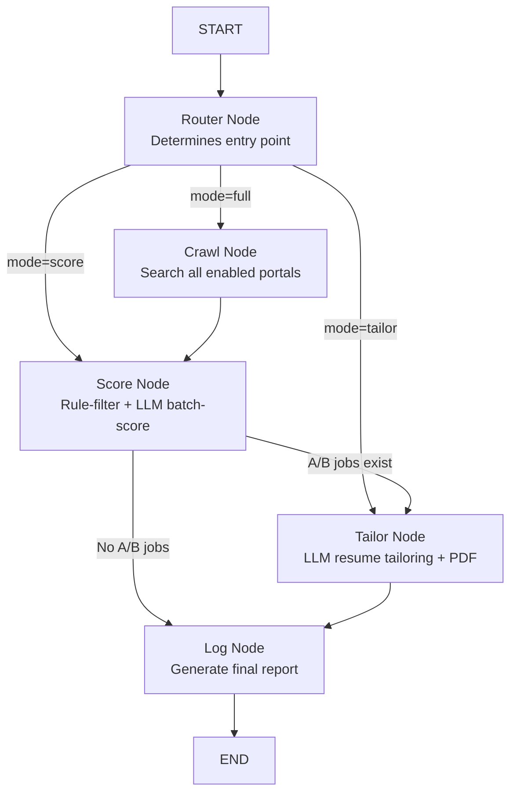

# 📖 JobBot — Complete Technical Documentation

> **Purpose**: This document provides full technical context about the JobBot project. Share this with any LLM, AI assistant, or developer to give them complete understanding of the project's architecture, codebase, design decisions, and current state.

---

## 🎯 What Is JobBot?

JobBot is an **AI-powered Telegram bot** that automates the end-to-end job search pipeline for software engineers. Instead of manually browsing job boards, scoring listings, and tailoring resumes, JobBot does it all autonomously:

1. **Crawls** 8 job portals simultaneously (Greenhouse, Lever, Ashby, Wellfound, Remotive, Himalayas, RemoteOK, HackerNews)
2. **Scores** each job listing against the user's profile using LLMs (A/B/C/D/F grading)
3. **Tailors** the user's LaTeX resume for each A/B-scored job, injecting relevant keywords
4. **Compiles** the tailored resume into a PDF using `pdflatex`
5. **Delivers** the scored report + tailored PDFs directly to the user via Telegram

The entire pipeline runs asynchronously in the background, so users get results without waiting.

---

## 🏗️ Architecture Overview

```
┌─────────────────────────────────────────────────────────────────┐
│                        TELEGRAM BOT LAYER                       │
│  bot/main.py          → Entry point, handler registration       │
│  bot/onboarding.py    → User profile setup conversation         │
│  bot/handlers/        → Command handlers (search, score, etc.)  │
│  bot/worker.py        → Background task queue + worker pool      │
└───────────────────────────┬─────────────────────────────────────┘
                            │ BotTask objects
                            ▼
┌─────────────────────────────────────────────────────────────────┐
│                    LANGGRAPH ORCHESTRATION LAYER                 │
│  agent/orchestrator.py → StateGraph pipeline compilation         │
│  agent/state.py        → AgentState TypedDict schema             │
│                                                                  │
│  Pipeline: Router → Crawl → Score → [Tailor | Log] → END        │
│  Modes: full | score-only | tailor-only                          │
└───────────────────────────┬─────────────────────────────────────┘
                            │ State updates
                            ▼
┌─────────────────────────────────────────────────────────────────┐
│                     BUSINESS LOGIC LAYER                         │
│                                                                  │
│  ┌──────────────┐  ┌──────────────┐  ┌──────────────────┐       │
│  │   CRAWLERS   │  │   SCORER     │  │   RESUME TAILOR  │       │
│  │ portals/     │  │ agent/nodes/ │  │ resume/          │       │
│  │ 8 portals    │  │ scorer.py    │  │ parser.py        │       │
│  │ base.py ABC  │  │ Pre-filter   │  │ tailor.py        │       │
│  │ greenhouse   │  │ Batch score  │  │ compiler.py      │       │
│  │ lever, ashby │  │ Cache check  │  │ (LaTeX → PDF)    │       │
│  │ wellfound    │  │ A/B filter   │  │                  │       │
│  │ remotive     │  │              │  │                  │       │
│  │ himalayas    │  │              │  │                  │       │
│  │ remoteok     │  │              │  │                  │       │
│  │ hackernews   │  │              │  │                  │       │
│  └──────┬───────┘  └──────┬───────┘  └────────┬─────────┘       │
│         │                 │                    │                  │
└─────────┼─────────────────┼────────────────────┼─────────────────┘
          │                 │                    │
          ▼                 ▼                    ▼
┌─────────────────────────────────────────────────────────────────┐
│                     INFRASTRUCTURE LAYER                         │
│                                                                  │
│  ┌──────────────┐  ┌──────────────┐  ┌──────────────────┐       │
│  │ LLM ROUTER   │  │  DATABASE    │  │  BROWSER ENGINE  │       │
│  │ router/      │  │  db/         │  │  browser/        │       │
│  │ Groq→Gemini  │  │  SQLite +    │  │  Playwright +    │       │
│  │ →Cerebras    │  │  SQLAlchemy  │  │  Stealth JS      │       │
│  │ →OpenRouter  │  │  ORM         │  │  Human sim       │       │
│  │ Rate-limit   │  │              │  │                  │       │
│  │ Failover     │  │              │  │                  │       │
│  └──────────────┘  └──────────────┘  └──────────────────┘       │
│                                                                  │
└─────────────────────────────────────────────────────────────────┘
```

---

## 📁 Complete File Structure

```
JobBot/
├── agent/                          # LangGraph orchestration
│   ├── orchestrator.py             # StateGraph pipeline definition (243 lines)
│   ├── state.py                    # AgentState TypedDict (29 lines)
│   ├── test_orchestrator.py        # Manual pipeline tests
│   └── nodes/
│       ├── scorer.py               # Job scoring with LLM (328 lines) ← ACTIVE
│       └── test_scorer.py          # Scorer tests
│
├── agents/                         # ⚠️ DEAD CODE — older version of agent/
│   └── nodes/
│       ├── scorer.py               # Older scorer (missing db_job_id, experience filter)
│       └── test_scorer.py
│
├── bot/                            # Telegram bot interface
│   ├── main.py                     # Bot entry point, lifecycle management (126 lines)
│   ├── onboarding.py               # ConversationHandler for /start (135 lines)
│   ├── worker.py                   # TaskQueue + background workers (311 lines)
│   └── handlers/
│       ├── search.py               # /search command handler (97 lines)
│       ├── agent_control.py        # /score and /tailor handlers (188 lines)
│       ├── stats.py                # /stats command handler (59 lines)
│       └── cancel.py               # /cancel command handler (29 lines)
│
├── browser/                        # Stealth browser automation
│   ├── __init__.py
│   ├── session.py                  # Playwright stealth context (99 lines)
│   ├── human_sim.py                # Human-like interaction simulation (41 lines)
│   └── test_browser.py
│
├── config/
│   ├── portals.yml                 # Portal configuration (companies, enabled flags)
│   └── profile.yml                 # Default user profile (fallback config)
│
├── db/                             # Database layer
│   ├── __init__.py                 # Module exports
│   ├── models.py                   # SQLAlchemy ORM models (104 lines)
│   ├── crud.py                     # CRUD operations (307 lines)
│   └── init_db.py                  # Database initialization script
│
├── portals/                        # Job portal crawlers
│   ├── __init__.py                 # Crawler registry + search_all() (112 lines)
│   ├── base.py                     # BaseCrawler ABC + JobListing dataclass (121 lines)
│   ├── greenhouse.py               # Greenhouse ATS API crawler (157 lines)
│   ├── lever.py                    # Lever ATS API crawler
│   ├── ashby.py                    # Ashby ATS GraphQL crawler
│   ├── wellfound.py                # Wellfound Playwright stealth crawler (156 lines)
│   ├── remotive.py                 # Remotive REST API crawler
│   ├── himalayas.py                # Himalayas REST API crawler
│   ├── remoteok.py                 # RemoteOK API crawler
│   ├── hackernews.py               # HackerNews Who's Hiring crawler
│   └── test_crawlers.py            # Crawler integration tests
│
├── resume/                         # Resume processing pipeline
│   ├── parser.py                   # LaTeX section extractor (33 lines)
│   ├── tailor.py                   # LLM-based resume tailoring (221 lines)
│   ├── compiler.py                 # LaTeX → PDF compilation (72 lines)
│   └── test_tailor.py              # Tailor unit tests
│
├── router/                         # LLM routing infrastructure
│   └── llm_router.py              # Multi-provider LLM router (318 lines)
│
├── utils/
│   └── jd_extractor.py            # Job description URL/text parser (74 lines)
│
├── tests/                          # End-to-end tests
│   ├── end2end.py                  # Full pipeline smoke tests (332 lines)
│   └── test_e2e_pipeline.py        # Pipeline E2E with DB assertions (177 lines)
│
├── requirements.txt                # Python dependencies
└── .gitignore
```

**Total**: ~35 Python files, ~3,500+ lines of code

---

## 🔧 Technology Stack

| Category | Technology | Purpose |
|----------|-----------|---------|
| **Language** | Python 3.10+ | Core language |
| **Bot Framework** | python-telegram-bot 20+ | Telegram bot interface |
| **AI Orchestration** | LangGraph 0.2+ | State machine pipeline |
| **LLM Providers** | Groq, Google Gemini, Cerebras, OpenRouter | AI inference (all free-tier) |
| **LLM Libraries** | langchain, langchain-groq, google-genai | LLM client SDKs |
| **HTTP** | httpx, aiohttp | Async HTTP requests for crawlers |
| **HTML Parsing** | BeautifulSoup4 | Job description extraction |
| **Browser Automation** | Playwright | Stealth scraping (Wellfound) |
| **Database** | SQLite + SQLAlchemy 2.0 | Data persistence |
| **Task Queue** | Custom async queue (in-process) | Background job processing |
| **Document Processing** | pdflatex (system dependency) | LaTeX → PDF compilation |
| **Config** | PyYAML, python-dotenv | Configuration management |
| **JSON Repair** | json_repair | Fix malformed LLM JSON output |

---

## 🔑 Core Data Models

### JobListing (Dataclass — `portals/base.py`)
```python
@dataclass
class JobListing:
    title:      str        # Job title
    company:    str        # Company name
    url:        str        # Job posting URL
    portal:     str        # Source portal (greenhouse, lever, etc.)
    jd_text:    str = ""   # Job description text
    location:   str = ""   # Job location
    portal_job_id: str = "" # Portal-specific ID for deduplication
```

### ScoredJob (Dataclass — `agent/nodes/scorer.py`)
```python
@dataclass
class ScoredJob:
    job: JobListing          # Original job listing
    db_job_id: Optional[int] # Database ID for the job
    score: str               # A/B/C/D/F grade
    match_percentage: int    # 0-100 match score
    strengths: List[str]     # What matches well
    gaps: List[str]          # What's missing
    recommendation: str      # Action recommendation
```

### AgentState (TypedDict — `agent/state.py`)
```python
class AgentState(TypedDict):
    user_id: int
    keyword: str
    location: Optional[str]
    portals: List[str]
    profile: Dict[str, Any]
    base_tex_path: str
    mode: Literal["full", "score", "tailor"]
    raw_jobs: List[JobListing]
    scored_jobs: List[ScoredJob]
    tailored_jobs: List[Dict[str, str]]
    final_report: str
    error: Optional[str]
```

### Database Models (SQLAlchemy — `db/models.py`)

| Model | Primary Key | Key Fields |
|-------|-------------|------------|
| **User** | `user_id` (Telegram ID) | `username`, `target_roles` (JSON), `skills` (JSON), `resume_path` |
| **Job** | `id` (auto-increment) | `user_id` (FK), `title`, `company`, `url`, `portal`, `jd_text`, `score`, `score_data` (JSON), `status` (enum) |
| **Application** | `id` (auto-increment) | `user_id` (FK), `job_id` (FK), `resume_version`, `applied_at`, `result` |

**JobStatus enum**: `NEW → SCORED → TAILORED → READY_TO_APPLY → APPLIED → SKIPPED → REJECTED`

---

## 🔄 Pipeline Flow (LangGraph)



### Detailed Stage Breakdown

**Stage 1 — Crawl (`crawl_node`)**:
- Loads enabled crawlers from `config/portals.yml`
- Each crawler implements `search(keyword, location)` → `List[JobListing]`
- Results are deduplicated by URL via `search_all()`
- API-based crawlers (Greenhouse, Lever, Ashby, Remotive, Himalayas, HackerNews) use public JSON/GraphQL endpoints
- Wellfound uses Playwright stealth browser
- RemoteOK uses direct HTTP with browser-like headers
- Rate limiting: 2-5s delays between companies

**Stage 2 — Score (`score_node`)**:
- **Rule-based pre-filter**: Drops jobs missing core/primary skills from JD
- **Experience filter**: Drops senior roles for juniors and vice versa
- **Score cache**: Checks DB for previously scored jobs (same user + URL)
- **Smart JD extraction**: Pulls "Requirements" section instead of truncating from start
- **Batch scoring**: Groups 3 jobs per LLM call for token efficiency
- **LLM scoring**: Uses structured JSON prompt with A-F rubric
- **JSON repair**: Uses `json_repair` library to fix malformed LLM output
- Only A/B-scored jobs proceed to tailoring

**Stage 3 — Tailor (`tailor_node`)**:
- Reads user's `base_resume.tex`
- Parses LaTeX to extract Summary, Skills, Experience sections via regex
- Wraps sections in XML tags (`<section_0>`, `<section_1>`, ...)
- Sends to LLM with strict anti-hallucination prompts
- Post-validation: checks >60% word retention to catch hallucinated rewrites
- Injects tailored content back into original LaTeX
- Compiles via `pdflatex` (runs twice for references)
- Updates DB status to `TAILORED`

**Stage 4 — Log (`log_node`)**:
- Generates a formatted Markdown report with pipeline stats
- Lists each tailored job with score, strengths, gaps, and PDF path

---

## 🤖 LLM Router System

The `LLMRouter` class manages 4 free-tier LLM providers with intelligent routing:

```
Priority Order: Groq (1) → Gemini (2) → Cerebras (3) → OpenRouter (4)

Task-specific ordering:
  - Scoring tasks: Groq → Gemini → Cerebras → OpenRouter
  - Tailoring tasks: Gemini → Groq → Cerebras → OpenRouter
```

**Features**:
- Per-provider RPM/TPM tracking with 60s rolling windows
- Automatic rate-limit detection via HTTP 429 or "rate limit" in error strings
- Cooldown periods with configurable `retry_after`
- `asyncio.Lock` for thread-safe provider selection
- Max retry loop with automatic failover to next provider
- `get_status()` method for admin monitoring

**Provider Details**:

| Provider | Model | RPM Limit | TPM Limit | Client |
|----------|-------|-----------|-----------|--------|
| Groq | llama-3.3-70b-versatile | 30 | 6,000 | `AsyncGroq` SDK |
| Gemini | gemini-2.0-flash | 15 | 1,000,000 | `google-genai` SDK |
| Cerebras | llama3.3-70b | 30 | 60,000 | OpenAI-compatible REST |
| OpenRouter | llama-3.3-70b-instruct:free | 20 | 200,000 | OpenAI-compatible REST |

---

## 📱 Telegram Bot Commands

| Command | Handler | Description |
|---------|---------|-------------|
| `/start` | `onboarding.py` | Onboarding wizard: Name → Roles → Core Skills → Primary Skills → Upload .tex |
| `/search <keyword>` | `search.py` | Full pipeline: Crawl → Score → Tailor → Deliver PDFs |
| `/score <url or text>` | `agent_control.py` | Score a specific job against profile |
| `/tailor <url or text>` | `agent_control.py` | Directly tailor resume for a specific JD |
| `/stats` | `stats.py` | View personal job search statistics |
| `/cancel` | `cancel.py` | Cancel all running/queued tasks |
| `/help` | `search.py` | Show available commands |

---

## 🕷️ Portal Crawlers

| Portal | Type | Method | Companies | Notes |
|--------|------|--------|-----------|-------|
| **Greenhouse** | ATS | Public JSON API | Stripe, Coinbase, Notion, Rippling, Shopify | Best crawler; no auth needed |
| **Lever** | ATS | Public JSON API | Netflix, Scale AI, Plaid | Clean API |
| **Ashby** | ATS | GraphQL API | Anthropic, OpenAI, Retool, Brex | Uses GraphQL mutation |
| **Wellfound** | Job Board | Playwright Stealth | Global search | Heaviest crawler; bot-detection risk |
| **Remotive** | Job Board | REST API | Global search | Clean public API |
| **Himalayas** | Job Board | REST API | Global search | Clean public API |
| **RemoteOK** | Job Board | HTTP + Browser Headers | Global search | Mimics browser requests |
| **HackerNews** | Forum | Algolia API | Global search | Searches "Who is Hiring" posts |

---

## 🔒 Environment Variables Required

```env
TELEGRAM_BOT_TOKEN=       # From @BotFather
GROQ_API_KEY=             # From console.groq.com
GEMINI_API_KEY=           # From Google AI Studio
CEREBRAS_API_KEY=         # From cerebras.ai
OPENROUTER_API_KEY=       # From openrouter.ai
```

---

## 🗃️ Database

- **Engine**: SQLite (`data/job_bot.db`)
- **ORM**: SQLAlchemy 2.0 with declarative base
- **Session Management**: Synchronous `SessionLocal` with `contextmanager` pattern
- **Migrations**: None — uses `create_all()` for schema creation
- **Unique Constraint**: `(user_id, url)` on Jobs table prevents duplicate entries

---

## ⚙️ Background Worker System

The `TaskQueue` class in `bot/worker.py` is the concurrency backbone:

- **Queue**: `asyncio.Queue(maxsize=20)` — bounded to prevent memory issues
- **Workers**: 2 concurrent workers started via `post_init` lifecycle hook
- **Deduplication**: MD5 hash of `user_id:task_type:keyword` prevents duplicate submissions
- **Cancellation**: Per-user via `asyncio.Event` signaling on `BotTask.cancel_event`
- **Stale Cleanup**: Tasks older than 10 minutes are auto-removed
- **Graceful Shutdown**: `signal_shutdown()` → `wait_for_drain(timeout=30)` → cancel workers
- **Error Recovery**: Failed tasks notify user via Telegram; worker continues processing

---

## 🧪 Testing

**Test files**:
- `tests/end2end.py` — Full pipeline smoke tests with mocked LLM and crawlers
- `tests/test_e2e_pipeline.py` — Pipeline E2E with real DB assertions
- `agent/test_orchestrator.py` — Manual orchestrator tests
- `agent/nodes/test_scorer.py` — Scorer unit tests
- `resume/test_tailor.py` — Tailor tests
- `portals/test_crawlers.py` — Crawler integration tests
- `browser/test_browser.py` — Browser stealth tests

**Testing strategy**: Uses `unittest.mock.patch` and `AsyncMock` to mock LLM calls and crawler results. Database tests use real SQLite with in-memory databases.

---

## 🐛 Known Issues (as of latest review)

1. **`score_command`** references `task` variable before it's defined (line 102 in `agent_control.py`)
2. **`_prepare_manual_job`** has inconsistent return values (3 vs 4 values on different error paths)
3. **`db/__init__.py`** imports `update_job_score` which doesn't exist in `crud.py`
4. **`_call_gemini`** is called with 2 args but expects 4 (in `llm_router.py`)
5. **`stats.py`** references `jobs_by_score` key which doesn't exist in the stats dict
6. **`agents/`** directory contains dead/outdated code (older scorer without `db_job_id`)
7. **`wellfound.py`** imports `human_warmup` from `browser.human_sim` which doesn't exist
8. **`browser/session.py`** has a JS variable scoping bug (`parameter` vs `parameters`)
9. **Sync DB** operations (`get_db()`) are called inside async handlers, blocking the event loop
10. **No input sanitization** for LaTeX — potential command injection via `\input{}`

---

## 📦 How to Run

```bash
# 1. Clone and setup
git clone <repo_url>
cd JobBot
python -m venv venv
venv\Scripts\activate  # Windows

# 2. Install dependencies
pip install -r requirements.txt
playwright install chromium

# 3. Configure environment
# Create .env file with required API keys (see above)

# 4. Ensure pdflatex is installed
# Windows: Install MiKTeX or TeX Live

# 5. Initialize database
python -m db.init_db

# 6. Run the bot
python -m bot.main
```

---

## 🎨 Design Decisions & Rationale

| Decision | Rationale |
|----------|-----------|
| LangGraph over raw async | Graph-based orchestration makes the pipeline inspectable and composable |
| Free-tier LLMs only | Zero-cost infrastructure; multi-provider failover ensures uptime |
| LaTeX resumes (not DOCX) | LaTeX gives pixel-perfect control and ATS-friendly PDFs |
| XML tags for LLM output | More reliable than JSON for structured LaTeX content |
| Sequential crawling | Avoids rate-limiting across portals |
| In-process task queue | Simpler than Celery/Redis for single-instance deployment |
| SQLite | Zero-config, sufficient for single-bot-instance MVP |
| Telegram | Free, widely accessible, rich API for file delivery |
